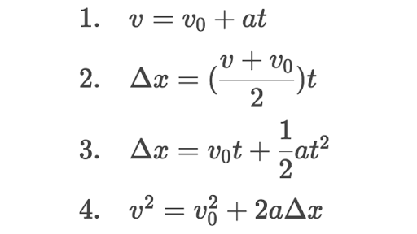

# Homework 2: Engineer's Toolkit
We're going to create a program that will allow an engineer to calculate the results of a number of equations. 
Specifically, the 4 kinematic equations for constant acceleration. Your program should have a menu that allows the user 
to choose between the kinematic equations.

Your program should be able to calculate the following formulas:


An example output of the application might look something like this:

```bash
Welcome to the ENGINEER'S TOOLKIT 
1) v_f = v_0 + at 
2) x_f = x_0 + v_0t + 1/2at 
3) v_f^2 = v_0 ^ 2 + 2a(x_f - x_0) 
4) x_f = x_0 = 1/2(v_f + v_0)t 
Please make your selection: 
1 
v_0: 
3 
a: 
4 
t: 
2 
answer: 11 

```
